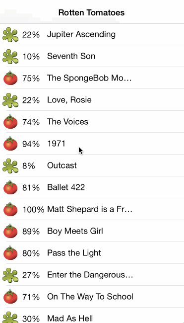

# RottenTomatoes
Rotten Tomatoes exercise for Codepath Bootcamp

Time spent: 8 hours

Completed user stories:

* [x] Required: User can see a list of movies from Rotten Tomatoes
* [x] Required: User can select a movie from the list and see its details
* [x] Required: User sees an activity spinner while the Rotten Tomatoes data is being loaded
* [x] Required: User sees a network error indicator at the top of the screen if Rotten Tomatoes data fails to load
* [x] Required: User can pull down on the table view to reload the data

